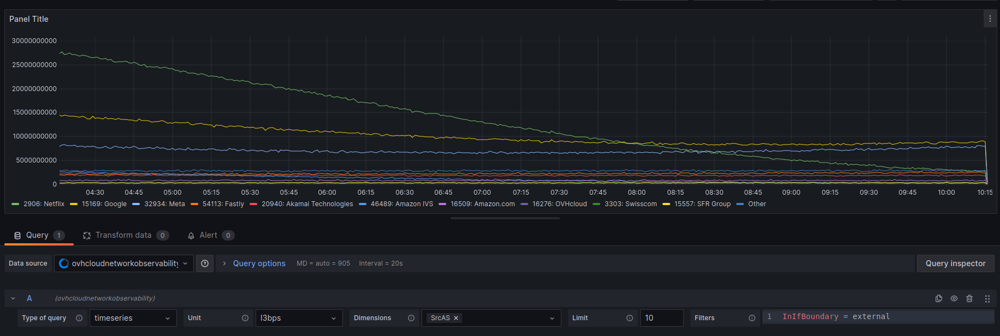
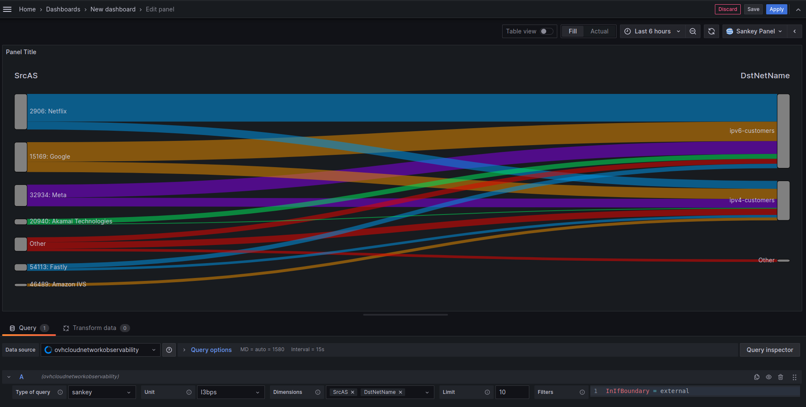

# OVH Akvorado Grafana Plugin

Plugin to display akvorado data

## Goal

This plugin aim to allow user to display [akvorado](https://github.com/akvorado/akvorado) data directly in Grafana.

## Run locally

To run locally the plugin:

```
npm install
npm run build
npm run server
```

### Use sankey plugin with docker compose

To display a sankey query you need the sankey plugin.
You can download the plugin [here](https://grafana.com/grafana/plugins/netsage-sankey-panel/?tab=installation)
Unzip the folder
Add the path to the folder to docker compose volumes:
`- /path/to/netsage-sankey-panel:/var/lib/grafana/plugins/netsage-sankey-panel`

## Add new data source

In grafana

- Add new data source
- Akvorado
- Add new data source
- Enter the base url; eg: https://demo.akvorado.net/


## Building queries

Queries can be built using pre-configured parameters.

### Query parameters

- Type of query:
  - sankey
    - _When using sankey at least two dimension must be used_
  - timeseries
- Unit
  - l3bps
  - pps
- Dimension
  - Multiselect list: values are fetch from the back end
- Limit: number of returned result
  - _The number of return result is in fact limit +1 where +1 is the value "other" showing the aggregation of all other values_
- Filters: expression to filter result
  - _The field is autocomplete and lint based on syntax checker_

### Query examples

Visualize the top 10 traffic per Source BGP AS for Ingress traffic, in bytes per second (pps)


Visualize the Top 10 Source BGP AS and Exporter Site for Ingress traffic, in packets per second (pps)

